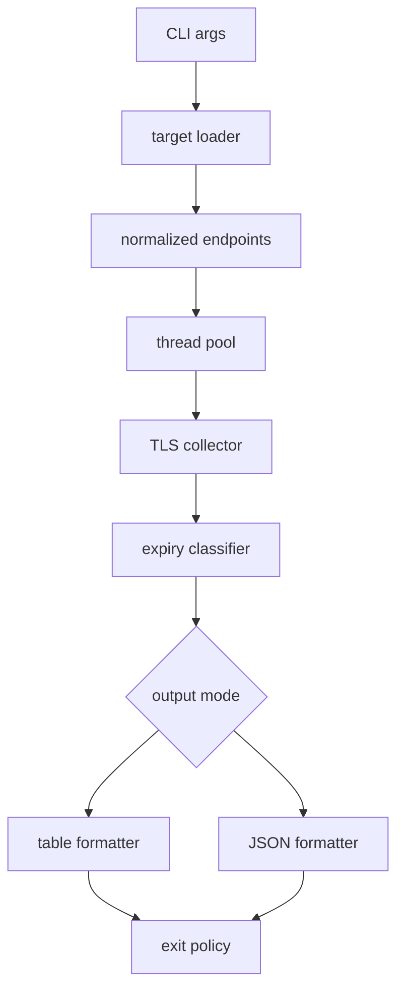
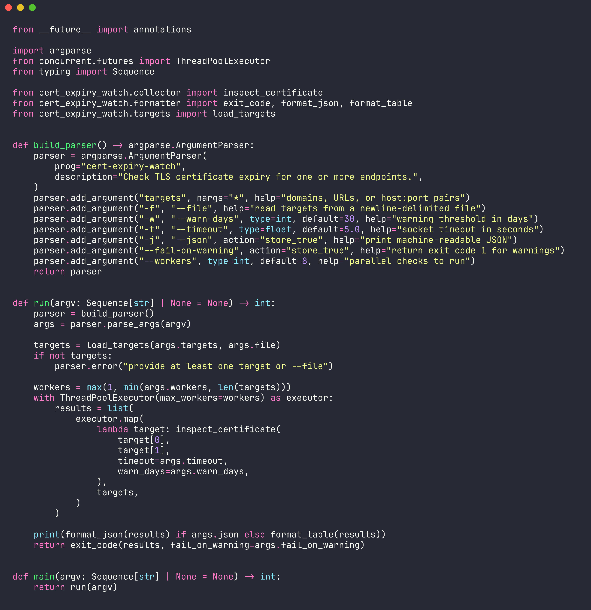

# cert-expiry-watch

Check TLS certificate expiry across domains before renewals become incidents.


## What It Does

| Capability | Detail |
| --- | --- |
| expiry checks | reads live TLS certificates from domains, URLs, or `host:port` targets |
| warning policy | marks certificates inside `--warn-days` as `warning` |
| CI-friendly | returns non-zero for expired or unreachable certificates |
| output modes | prints compact tables or JSON for automation |
| bulk input | accepts newline-delimited target files with comments |

## Install

```bash
git clone https://github.com/mertefekurt/cert-expiry-watch.git
cd cert-expiry-watch
python -m venv .venv
. .venv/bin/activate
pip install -e .
```

## Usage

```bash
cert-expiry-watch example.com api.example.com:8443
cert-expiry-watch --file domains.txt --warn-days 21
cert-expiry-watch example.com --json
```

## CLI Reference

| Argument / Flag | Purpose | Default |
| --- | --- | --- |
| `targets` | domains, URLs, or `host:port` values | none |
| `-f`, `--file` | newline-delimited targets file | none |
| `-w`, `--warn-days` | days before expiry to mark `warning` | `30` |
| `-t`, `--timeout` | socket timeout in seconds | `5.0` |
| `-j`, `--json` | print machine-readable JSON | `false` |
| `--fail-on-warning` | return exit code `1` for warnings | `false` |
| `--workers` | parallel certificate checks | `8` |

## Architecture



## Code Snapshot



## Project Layout

```text
src/cert_expiry_watch/
  cli.py          argument parsing and orchestration
  collector.py    TLS socket inspection
  formatter.py    table, JSON, and exit policy
  models.py       result and status types
  targets.py      target parsing and file loading
tests/
  test_*.py       focused unit tests
```

## Development

```bash
python -m venv .venv
. .venv/bin/activate
pip install -e ".[dev]"
pytest
```

## License

MIT
