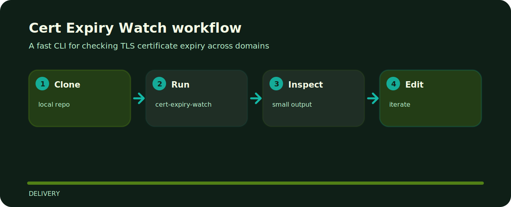

# Cert Expiry Watch

This project is a small, inspectable delivery tool. It prefers concrete examples and local files over hidden setup.


## How it runs



## Start here

```bash
git clone https://github.com/mertefekurt/cert-expiry-watch.git
cd cert-expiry-watch
python -m pip install -e ".[dev]"
cert-expiry-watch --help
```

## Repository landmarks

```text
src/            package source
tests/          test coverage
.gitignore      project file
pyproject.toml  package metadata
```
