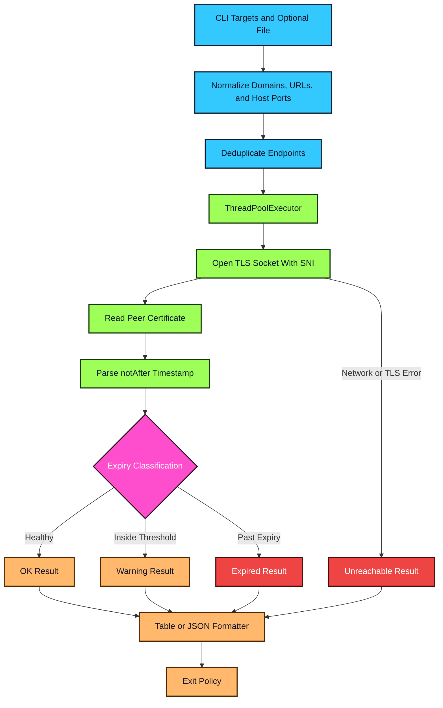

<div align="center">


</div>


`cert-expiry-watch` inspects live certificates for domains, URLs, and `host:port` endpoints, then classifies each target as ok, warning, expired, or unreachable. It is built for maintainers who want a tiny dependency-light command that fits cron jobs, release checks, CI workflows, and operations runbooks.

<table>
  <tr>
    <td width="50%" valign="top">


- 🔐 Reads real TLS certificates over sockets with SNI support
- ⏳ Calculates exact expiry dates and remaining days
- 🚨 Separates ok, warning, expired, and unreachable states
- 📄 Loads bulk target lists with comment support
- ⚡ Runs checks in parallel with a configurable worker pool
- 🤖 Prints compact tables or JSON with CI-friendly exit behavior

  </td>
  <td width="50%" valign="top">


  </td>
  </tr>
</table>





```bash
git clone https://github.com/mertefekurt/cert-expiry-watch.git
cd cert-expiry-watch
python -m venv .venv
. .venv/bin/activate
pip install -e .
cert-expiry-watch example.com api.example.com:8443
```

<details>
<summary>🛠️ View CLI Reference / Advanced Config</summary>

| Command | Purpose |
| --- | --- |
| `cert-expiry-watch example.com` | Check one domain on port 443 |
| `cert-expiry-watch api.example.com:8443` | Check a custom TLS port |
| `cert-expiry-watch https://example.com` | Normalize a URL into a TLS endpoint |
| `cert-expiry-watch --file domains.txt` | Read newline-delimited targets from a file |
| `cert-expiry-watch example.com --json` | Emit machine-readable JSON |

| Flag | Default | Purpose |
| --- | ---: | --- |
| `targets` | none | Domains, URLs, or `host:port` targets |
| `-f`, `--file` | none | Read additional targets from a file |
| `-w`, `--warn-days` | `30` | Mark certificates inside this window as warnings |
| `-t`, `--timeout` | `5.0` | Socket timeout in seconds |
| `-j`, `--json` | `false` | Print JSON instead of a table |
| `--fail-on-warning` | `false` | Return exit code `1` for warning results |
| `--workers` | `8` | Maximum parallel certificate checks |

| Status | Meaning |
| --- | --- |
| `ok` | Certificate expires after the warning window |
| `warning` | Certificate expires within `--warn-days` |
| `expired` | Certificate is already past its expiry timestamp |
| `unreachable` | Network, DNS, TLS, or certificate parsing failed |

</details>


```text
cert-expiry-watch/
├── src/cert_expiry_watch/
│   ├── cli.py        # argument parsing, workers, and orchestration
│   ├── collector.py  # socket/TLS certificate inspection
│   ├── formatter.py  # table, JSON, and exit-code behavior
│   ├── models.py     # status and result models
│   └── targets.py    # target normalization and file loading
├── tests/
└── assets/
    └── code-snapshot.png
```


MIT
